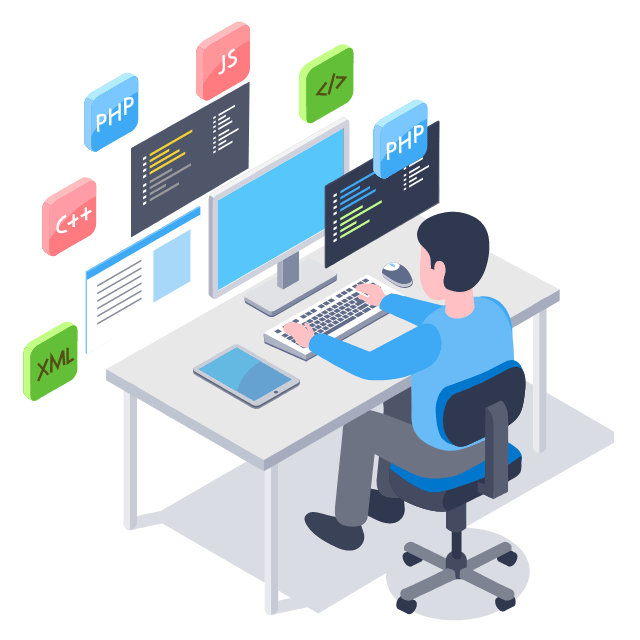

<a href="#">
    
 
         
    

</a>
<a href="#">
    
<!--  -->

</a>
<h1 align="center">
    
</h1>

<h2 align="center">A passionate AI Engineer / Data Scientist</h2>
 

 

    
**🌱 I’m currently learning Go Lang, Docker, Supabase, AWS, Oracle, Azure**

**💬 Ask me about MERN, Firebase, Computer Vision, Python, MySQL,  
Mongodb, Tensorflow, AI&ML or anything&nbsp;[here...](https://sandipanrakshit.vercel.app/)** 

**🔭 I’m looking to collaborate on Data Science and Machine Learning projects** 

 

 
  &nbsp&nbsp
  

 

 
<h2 align="center">⚒️ Languages-Frameworks-Tools ⚒️</h2>
 

    <a href="#">
    
     
    </a>

 

  <h2>🐍 My Contributions 🐍</h2>

    

<h2 align="center">⚡ Stats ⚡</h2>
 

    
    
  

           
  

    
  

   

# 🚀 About Me 🚀

<table style="border: none; border-collapse: collapse;">
  <tr style="border: none;">
    <!-- Professional Journey on the Left -->
    <td style="border: none; vertical-align: top; padding: 20px;">
      <table style="border: none; border-collapse: collapse;">
        <tr style="border: none;">
          <td style="border: none;">
            <h3>👨‍💻 Professional Journey</h3>
            <ul style="list-style: none; padding: 0; margin: 0;">
              <li>📚 Computer Science Student at <b>MCKV Institute of Engineering</b></li>
              <li>🎯 Focusing on <b>Deep Learning</b> & <b>Computer Vision</b></li>
              <li>🌱 Building robust <b>Backend Systems</b></li>
              <li>⚡ Always exploring new technologies</li>
            </ul>
            <h3>🛠️ Core Competencies</h3>
            <ul style="list-style: none; padding: 0; margin: 0;">
              <li><b>AI/ML</b>: Deep Learning, Neural Networks, Computer Vision</li>
              <li><b>Backend</b>: Django, REST APIs, System Design</li>
              <li><b>Languages</b>: Python, JavaScript, Go, C++</li>
              <li><b>Databases</b>: PostgreSQL, MySQL</li>
            </ul>
          </td>
        </tr>
      </table>
    </td>
    <!-- Skills Spotlight on the Right -->
    <td style="border: none; vertical-align: top; padding: 20px;">
      <table style="border: none; border-collapse: collapse;">
        <tr style="border: none;">
          <td style="border: none;">
            <h3>💡 Skills Spotlight</h3>
            <pre style="background: #f4f4f4; padding: 10px; border-radius: 5px; font-size: 14px; margin: 0;">
Deep Learning    ███████████░░   90%
Computer Vision  ██████████░░░   85%
Backend Dev      ████████░░░░░   75%
DevOps           ███████░░░░░░   65%
            </pre>
            <h3>🎯 Goals 2024</h3>
            <ul style="list-style: none; padding: 0; margin: 0;">
              <li>📱 Build 3 Major Projects</li>
              <li>📚 Master MLOps Pipeline</li>
              <li>🌐 Contribute to Open Source</li>
              <li>📖 Share Knowledge through Blogs</li>
            </ul>
          </td>
        </tr>
      </table>
    </td>
  </tr>
</table>

## 🛠️ Tech Arsenal 🛠️
<table style="border: none; border-collapse: collapse;">
  <tr style="border: none;">
    <!-- Tech Stack Table on the Left -->
    <td style="border: none;">
      <table align="center" style="border: none; border-collapse: collapse;">
        <tr style="border: none;">
          <td align="center" width="96" style="border: none;">
            
             Python
          </td>
          <td align="center" width="96" style="border: none;">
            
             Django
          </td>
          <td align="center" width="96" style="border: none;">
            
             JavaScript
          </td>
          <td align="center" width="96" style="border: none;">
            
             Go
          </td>
        </tr>
        <tr style="border: none;">
          <td align="center" width="96" style="border: none;">
            
             C++
          </td>
          <td align="center" width="96" style="border: none;">
            
             Docker
          </td>
          <td align="center" width="96" style="border: none;">
            
             MySQL
          </td>
          <td align="center" width="96" style="border: none;">
            
             GitHub
          </td>
        </tr>
        <tr style="border: none;">
          <td align="center" width="96" style="border: none;">
            
             PyTorch
          </td>
          <td align="center" width="96" style="border: none;">
            
             TensorFlow
          </td>
          <td align="center" width="96" style="border: none;">
            
             OpenCV
          </td>
          <td align="center" width="96" style="border: none;">
            
             PostgreSQL
          </td>
        </tr>
      </table>
    </td>
    <!-- Spacer and GIF -->
    <td style="width: 100px; border: none;"></td>
    <!-- Hacker GIF on the Right -->
    <td align="center" valign="top" style="border: none;">
      
    </td>
  </tr>
</table>

<h2 align="center">🔃 Connect with me: 🔃</h2>
 

        <table style="border-collapse: collapse; border: none;">
            <tr>
                <td style="border: none; ">
                    
                </td>
                <td style="border: none;">
                    
                <td style="border: none;">
                    
                </td>
                <td style="border: none;">
                    
                </td>
                <td style="border: none;">
                    
                </td>
           <!--   <td style="border: none;">
                    
                </td>  -->
                </td>
            </tr>
        </table>
    

<h2 align="center">⚡ More About Me ⚡</h2>

🔭 <b>Currently working on:</b> Deep Learning Projects  
🌱 <b>Learning:</b> MLOps and System Design  
👯 <b>Looking to collaborate on:</b> AI/ML Projects  
💬 <b>Ask me about:</b> Python, Deep Learning, Computer Vision  
⚡ <b>Fun fact:</b> I can code for hours with just coffee and music!

 

 

    

    

 

